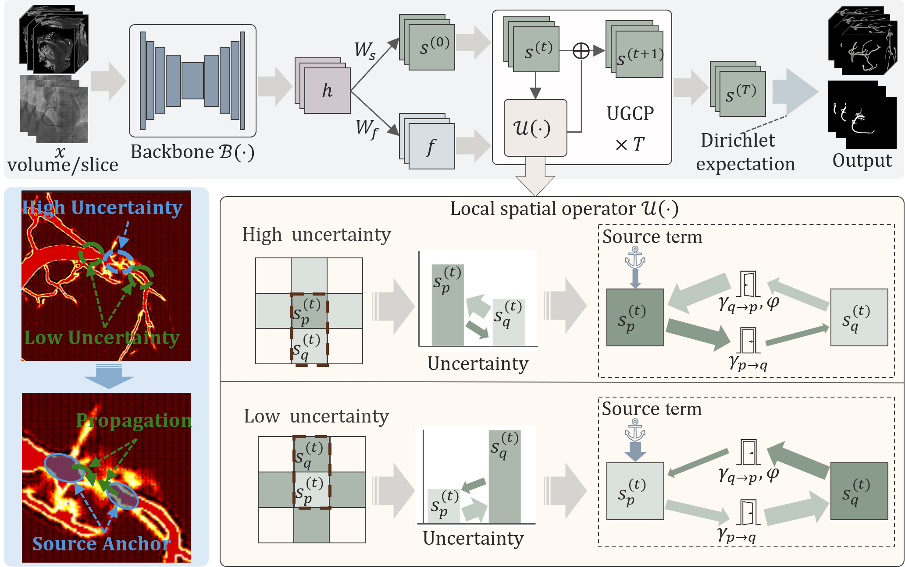

# Uncertainty-Guided Conservative Propagation for Structured Inference in Vessel Segmentation

Official code for **Uncertainty-Guided Conservative Propagation for Structured
Inference in Vessel Segmentation**.

Authors: Huan Huang, Michele Esposito, and Chen Zhao.

Method: **Uncertainty-Guided Conservative Propagation (UGCP)**.



## Overview

UGCP is a plug-in module for vessel segmentation that performs finite-step
logit-space prediction updates. Predictive uncertainty guides reliable regions
to support ambiguous regions, while structure-aware modulation and a source
anchor reduce unreliable propagation and excessive drift.

This release provides a runnable **3D Tof-MRA** pipeline. The 2D code is included
only as reusable model definitions.

## Data

The 3D Tof-MRA experiment uses the COSTA cerebrovascular segmentation dataset:

```bibtex
@article{data_brain,
  title={COSTA: A multi-center TOF-MRA dataset and a style self-consistency network for cerebrovascular segmentation},
  author={Mou, Lei and Lin, Jinghui and Zhao, Yifan and Liu, Yonghuai and Ma, Shaodong and Zhang, Jiong and Lv, Wenhao and Zhou, Tao and Liu, Jiang and Frangi, Alejandro F and others},
  journal={IEEE transactions on medical imaging},
  volume={43},
  number={12},
  pages={4442--4456},
  year={2024},
  publisher={IEEE}
}
```

Use the same raw layout as the original Tof-MRA project:

```text
Dataset/Raw/
  imagesTr/
  labelsTr/
  imagesTs/
  labelsTs/
```

The official dataset has its own train/test split. In this code, cases are pooled
and re-split at the case level for cross-validation.

## Preprocessing

Run preprocessing in three steps:

```powershell
python Dataset/step1_preprocess.py --raw_root Dataset/Raw --save_root Dataset/Preprocessed
python Dataset/step2_offline_sample.py --preprocessed_dir Dataset/Preprocessed
python Dataset/step3_split_fold.py --preprocessed_dir Dataset/Preprocessed --num_folds 5 --seed 42
```

Step 1 resamples and normalizes raw volumes. Step 2 generates offline 3D
training patches. Step 3 creates case-level K-fold split files.

## Training And Testing

Train one fold:

```powershell
python train_3d.py --model_name Unet3D_UGCP --fold 1
```

Test trained experiments:

```powershell
python test_3d.py
```

Supported 3D models:

```text
Unet3D
SwinUNETR3D
Unet3D_UGCP
SwinUNETR3D_UGCP
```

## Code Structure

```text
UGCP/
  configs_3d.py
  dataset_3d.py
  losses_3d.py
  misc_3d.py
  one_epoch_3d.py
  train_3d.py
  test_3d.py
  FLOPs.py
  Dataset/
    step1_preprocess.py
    step2_offline_sample.py
    step3_split_fold.py
  models/
    unet2d.py
    unet3d.py
    swin2d.py
    swin3d.py
    unet2d_ugcp.py
    unet3d_ugcp.py
    swin2d_ugcp.py
    swin3d_ugcp.py
```

## Installation

```powershell
pip install -r requirements.txt
```

## Complexity

```powershell
python FLOPs.py --mode 3d
python FLOPs.py --mode 2d
python FLOPs.py --mode all
```
